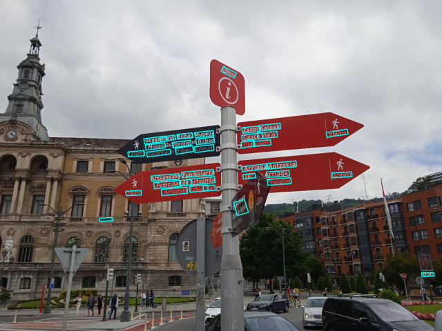
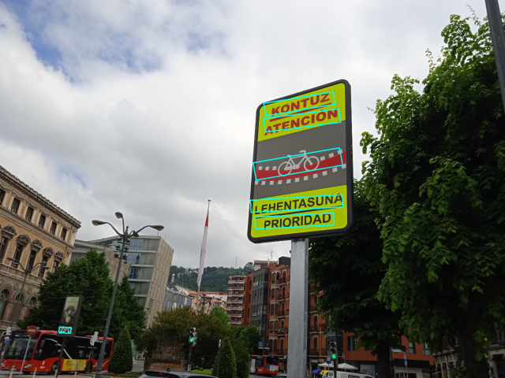

# EASTLite

EASTLite is a lightweight implementation of EAST based on MobileNet, which significantly speeds up the execution and makes the
algorithm friendlier to resource-constrained devices. It is written with TensorFlow 2 and Keras's Functional API.

Credit to 
https://github.com/argman/EAST, whose code we have used for geometric operations  and data augmentation in the ground truth generations, and for the post-processing and NMS. You can also change the base model to ResNet by using the flag `--base_model resnet`.

## Launching the demo web
You can very easily set up a demo web by building and running the Dockerfile. This is the easiest way to set up GPU acceleration easily using [NVIDIA Container Toolkit](https://github.com/NVIDIA/nvidia-docker/blob/master/README.md#quickstart).

Build the image with
```
docker build -t east-lite-web .
```
and run a GPU-accelerated container with
```
docker run --name east-lite-web -p 8000:8000 -p 3000:3000 -d --gpus all east-lite-web
```

Then navigate to `http://localhost:3000` and check out the algorithm and its speed! You can find out whether GPU acceleration is on via the Docker logs (with `docker logs east-lite-web`) or by GETting the backend's root at `http://localhost:8000`.

## How to use
Download [the pretrained weights](https://drive.google.com/file/d/1_SyIM-CNTBqdPsviw2aVa7qXjavjtRY0/view?usp=sharing). This model obtains an F-score of 0.749 on ICDAR15 (if you train a better version please submit it :blush:).

After downloading the checkpoint, you can run inference by executing 
```
  python infer.py --checkpoint_path /tmp/ckpt --data_path demo_inputs/ --visualize --dont_write
```

## How to train
You can train the network by passing the following arguments with the path to 
the training and validation sets:

```
  python train.py --training_data_path /tmp/train_ds/ --validation_data_path /tmp/val_ds/ --batch_size B
```

For a full list of flags run `python train.py --help`.

The dataset must be comprised of pictures and txt files in the format of the ICDAR15 ground truth text files.

```
158,128,411,128,411,181,158,181,Footpath
443,128,501,128,501,169,443,169,To
64,200,363,200,363,243,64,243,Colchester
394,199,487,199,487,239,394,239,and
72,271,382,271,382,312,72,312,Greenstead  
```

In our training process, we have used ICDAR15's and ICDAR13's training datasets for training, and ICDAR15's test set for validation.

## Metrics

| Method    | Precision | Recall  | H-mean  | Parameters|
| ------    | ------    | ------  | ------  | ------    |
| EAST      | 0.847     | 0.773   | 0.808   | 24.23M    |
| EASTLite  | 0.841     | 0.675   | 0.749   | 3.66M     |

## Examples



